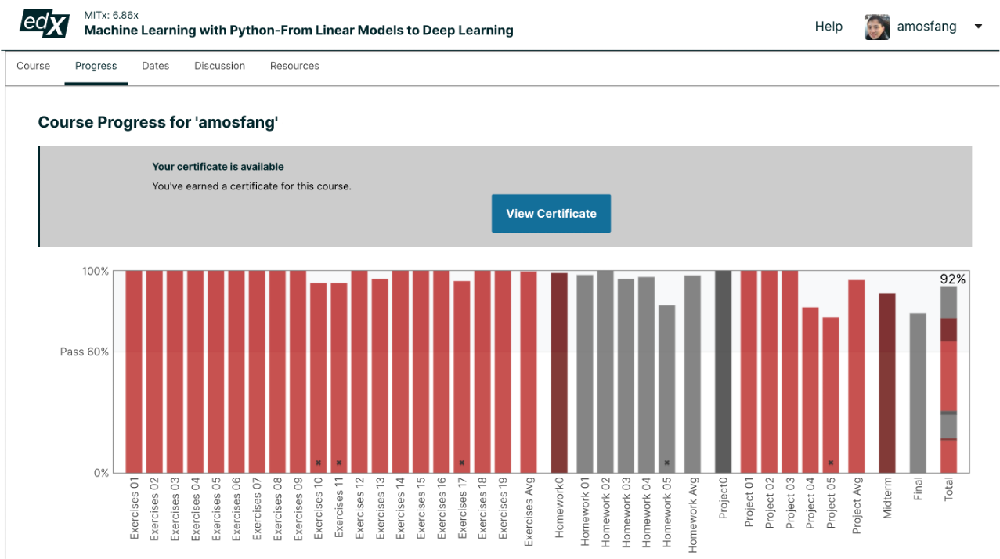

# MITx: 6.86x Machine Learning with Python-From Linear Models to Deep Learning

Total score: 92%
Mid-term Exam: 89%
Final Exam: 79%

---

*MIT Micromasters in Statistics and Data Science*[mitx 6.86 progress 20May2023]
