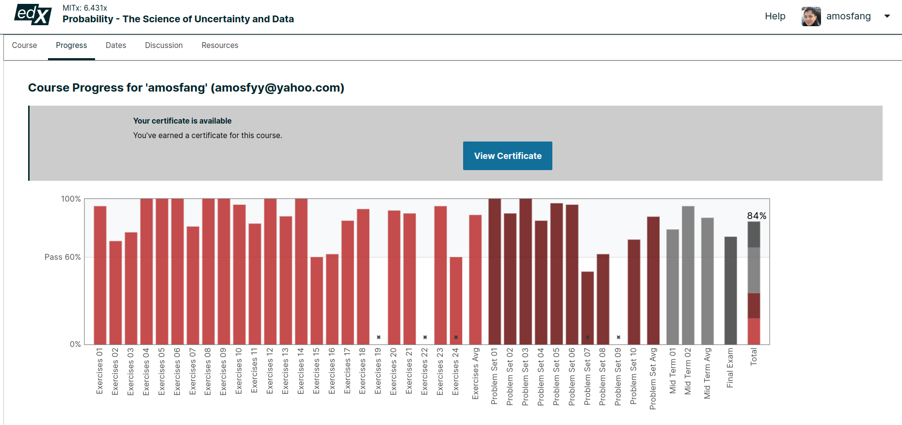
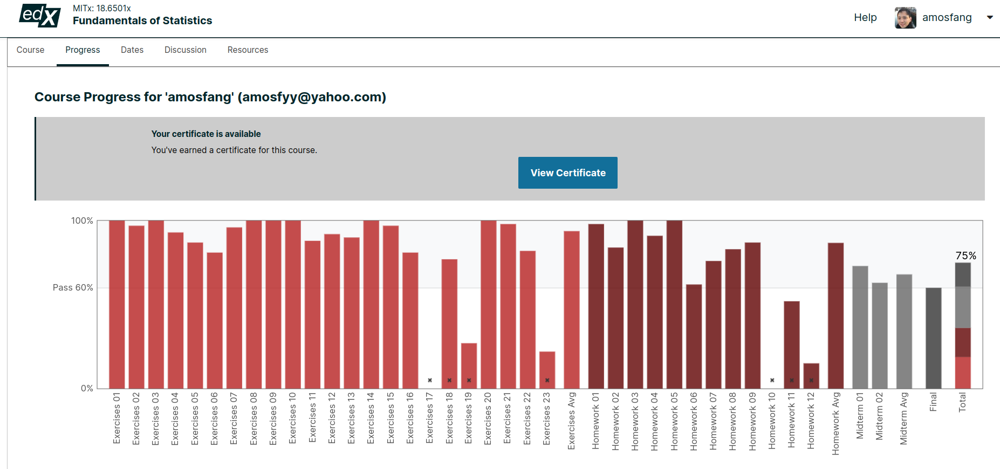
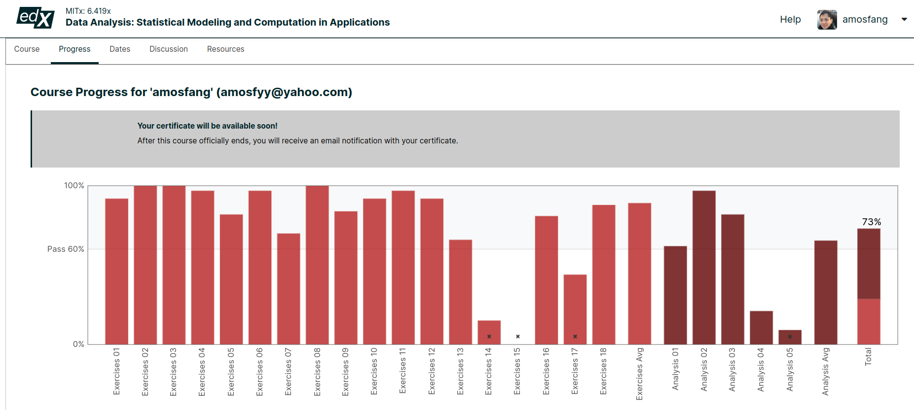

# My MITx Micromasters in Statistics and Data Science Journey

## Background
I did my bachelor's and master's degree in Chemical Engineering with many numerical courses because I enjoy watching computers solve linear algebra in MATLAB and C++. If I had a a profession I could choose, it would be a role as a research scientist.

## 2023

In late February 2023, shortly after Chinese New Year, I decided to learn machine learning seriously from the best online course. Previously, I did many edX online courses and I know that the Micromasters in Statistics and Data Science is the hardest nut to crack. I took many years to complete 5 out of 6 courses from the MITx Micromasters in Supply Chain Management so I certainly had a history of struggling to complete certification programs and courses. Over the years, I have also learnt that certificatons are only as good as the value you can create by applying the knowledge, however in practice, it is harder to learn anything without being committed to a course so I decided to pursue courses again. This time round, I will do both courses and side projects so that I also learn by working on real world solutions.

As 2023 draws to an end, I decided to document my data science journey in order to stay motivated. Here are my achievements and misses.

| Achievements    | Date of Completion |
| -------- | ------- |
| MITx 6.86 Machine Learning| May 2023    |
| MITx 6.431 Probability | Aug 2023     |
| MITx 18.6502 Statistics   | Aug 2023    |
| Udacity Deep Learning Nanodegree   | Aug 2023    |
| Nordic RoadAI hackathon  | Sep 2023    |
| Google Cloud Platform Associate Cloud Engineer   | Oct 2023    |
| MITx Micromasters in Supply Chain Management Comprehensive Exam | Nov 2023    |
| MITx 6.419 Data Analysis  | Dec 2023    |
| Nordic RoadAI Extended Paper (submitted)  | Dec 2023    |

| Misses   | Expected date of Completion |
| -------- | ------- |
| ~~Nordic RoadAI Extended Paper~~  | ~~Dec 2023~~    |
| Udacity Machine Learning DevOps Nanoegree| Feb 205    |
| Google Tensorflow Developer Certification | Did not attempt    |
| ~~Microsoft AI-102 Artificial Intelligence Associate Exam~~   | ~~Apr 2024~~    |
| ~~Microsoft DP-100 Data Scientist Associate Exam~~   | ~~Apr 2024~~    |
| MITx Micromasters in Statistics and Data Science Comprehensive Exam | Nov 2024    |
| GMAT Exam  | Apr 2024    |
| MIT Climate Hack   | No dateline   |

| Stack   | Project Experience |
| -------- | ------------------ |
| PySpark | Ingested 20GB of sensor data and performed data ETL, machine and deep learning on a road construction project |
| Microsoft Azure AI services | Built an interactive chatbot using Microsoft AI Question and Answering and Language Services |
| Tensorflow | Built an LSTM autoencoder and used its reconstruction loss to perform anomaly detection in vibration data |
| Microsoft COCO | Used `labelImg` to annotate images and trained object detector model to identify taxis on Singapore's expressways |
| Ditto | Other techniques learnt from building a chatbot, autoencoder and image classifier |

--
## Micromasters in Statistics and Data Science course transcript

## MITx: 6.86x Machine Learning with Python-From Linear Models to Deep Learning

Total score: 92%
Mid-term Exam: 89%
Final Exam: 79%

---

*MIT Micromasters in Statistics and Data Science*[mitx 6.86 progress 20May2023]

## MITx: 6.431x Probability - The Science of Uncertainty and Data

Total score: 84%
Mid-term Exam: 79%
Mid-term Exam: 95%
Final Exam: 74%

---

*MIT Micromasters in Statistics and Data Science*[mitx 6.431 progress 19Aug2023]

## MITx: 18.6502x Fundamental in Statistic

Total score: 75%
Mid-term Exam: 73%
Final Exam: 68%

---

*MIT Micromasters in Statistics and Data Science*[mitx 18.6502 progress 19Aug2023]

## MITx: 6.431x Data Analysis: Statistical Modeling and Computation in Applications

Total score: 73%

---

*MIT Micromasters in Statistics and Data Science*[mitx 18.6502 progress 19Aug2023]

--

## MITx: CFx Capstone Exam in Statistics and Data Science

Target Date: Apr 2024
